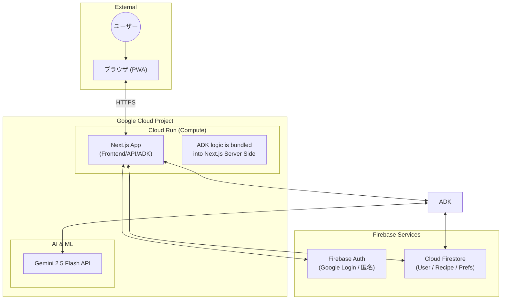
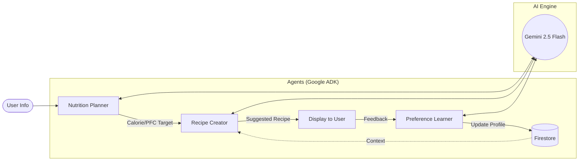

# システムアーキテクチャ構成図

本プロジェクト（FaveFit）が完成した際の、インフラおよびエージェントの構成図です。

## 1. インフラ構成図 (Google Cloud & Firebase)

## 2. エージェント連携フロー

各エージェントは Google ADK を介して定義され、特定の責務を持ちます。

## 3. コンポーネントの役割

| コンポーネント | 技術 | 役割 |
| :--- | :--- | :--- |
| **Frontend** | Next.js 16 (App Router) | UI/UX、Server Actions によるエージェント呼び出し。 |
| **Backend** | Google ADK (TypeScript) | Next.js プロセス内で動作。 Planner, Creator, Learner の実行制御。 |
| **AI Model** | Gemini 2.5 Flash | レシピ生成、栄養素推定、感情・好み分析の実行。 |
| **Database** | Cloud Firestore | ユーザープロフィール、計算済み目標、生成レシピ、学習済み好みの保存。 |
| **Authentication** | Firebase Auth | ゲストログインおよび Google アカウント連携によるユーザー識別。 |
| **Infrastructure** | Google Cloud Run | コンテナ化されたアプリケーションのホスティング。 |

## 4. データフローの概要
1. **オンボーディング:** ユーザーが身体情報を入力。**Nutrition Planner Agent** が最適なカロリーとPFC目標を算出。
2. **レシピ提案:** ユーザーが「今日の気分」を選択。**Recipe Creator Agent** が目標栄養素と過去の好みを踏まえたレシピを生成。
3. **学習:** ユーザーがレシピの感想を入力。**Preference Learner Agent** が内容を分析し、Firestore上の好みプロファイルを更新。
