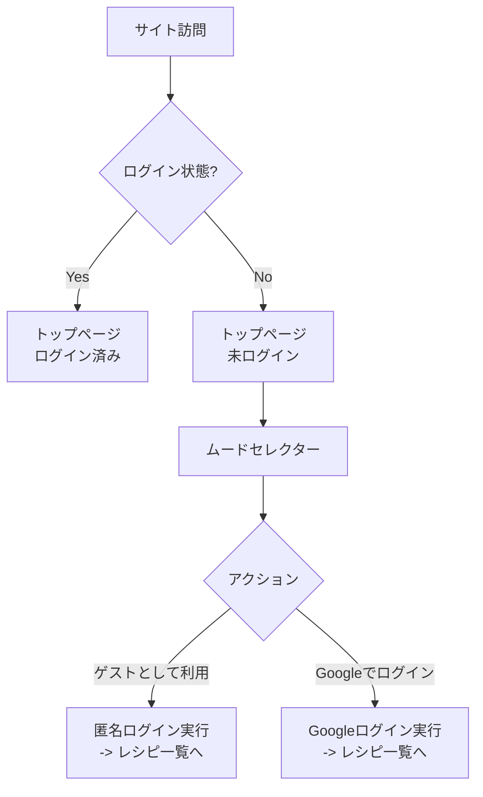
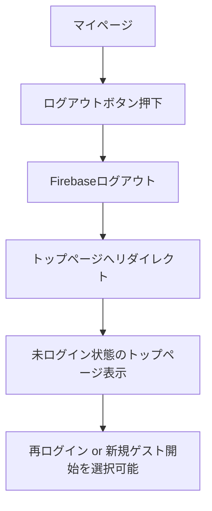
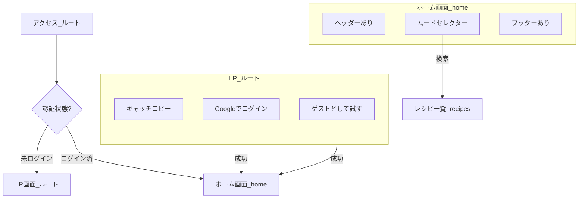

# 認証フロー改善案

## 現状の課題

1. **強制ゲスト作成**: サイト訪問時に自動的に匿名アカウントが作成されるため、ユーザーがログインを選択する余地がない。
2. **ログアウト後の再開**: ログアウトしても、トップページに戻ると（またはリロードすると）再度新規ゲストが作成されてしまう。
3. **視認性**: ログイン中のユーザー情報がわかりにくい。

## 提案フロー

### 1. 初回訪問 / 未ログイン時

ユーザーがサイトにアクセスした際、自動ログインは行わない。

### 2. ログアウトフロー

## 必要な修正点

### `src/components/auth-provider.tsx`

- **変更前**: マウント時に `!currentUser` なら即座に `signInAnonymously()`。
- **変更後**: 自動ログインを廃止。ユーザーのアクション（ボタンクリック）によって `signInAnonymously()` または `signInWithGoogle()` を呼び出すように変更。

### `src/app/page.tsx` (トップページ)

- **変更前**: ムードセレクターのみ表示。
- **変更後**:
  - 未ログイン時は「ゲストで開始」「Googleでログイン」の導線を追加。
  - ログイン時は `/home` へリダイレクト。

### `src/components/header.tsx`

- **変更前**: 常に表示。
- **変更後**: パスが `/` の場合は非表示。

## 画面遷移フロー修正案 (Route Group不使用版)

### 3. ディレクトリ構成と遷移

### 4. コンポーネント制御

- **ヘッダー/フッター**: `src/components/header.tsx` 等で `usePathname()` を使用し、パスが `/` の場合はレンダリングしない（nullを返す）。
- **トップページ (`src/app/page.tsx`)**:
  - 未ログイン時: LPコンテンツを表示。
  - ログイン時: `/home` へリダイレクト。
  - 認証アクション（Google/ゲスト）完了時: `/home` へプッシュ。
- **ホーム画面 (`src/app/home/page.tsx`)**:
  - 新規作成。ムードセレクターを表示。
  - 未ログインでアクセスされた場合: `/` へリダイレクト（Protected Route化）。
