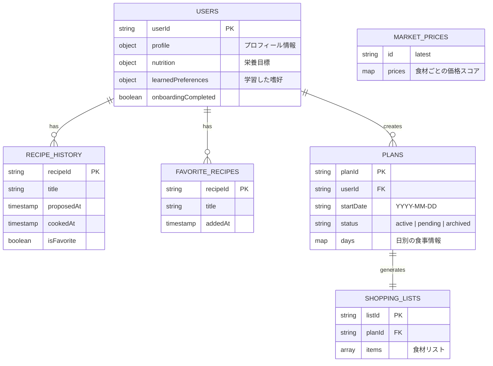

# Firestore データベース設計書

FaveFit のデータ構造の概要です。

## コレクション構造 (ER図風)

## パス階層一覧

| コレクション / ドキュメント | パス構造 | 説明 | 型定義 |
| :--- | :--- | :--- | :--- |
| **Users** | `/users/{userId}` | ユーザーの基本設定・身体情報 | `UserDocument` |
| **Recipe History** | `/recipeHistory/{userId}/recipes/{recipeId}` | 提案されたレシピの履歴 | `RecipeHistoryItem` |
| **Favorite Recipes** | `/favoriteRecipes/{userId}/recipes/{recipeId}` | お気に入りレシピのクイックアクセス | `FavoriteRecipe` |
| **Plans** | `/plans/{planId}` | 週間（または数日間）の食事計画 | `PlanDocument` |
| **Shopping Lists** | `/shoppingLists/{listId}` | プランに紐づく買い物リスト | `ShoppingListDocument` |
| **Market Prices** | `/marketPrices/latest` | 市場価格データのバッチ実行結果 | `MarketPriceDocument` |

## 実装上の注意

- **型安全なアクセス**: `src/server/db/firestore/collections.ts` にある `collections` または `docRefs` ヘルパーを使用してください。
- **コンバーター**: `withConverter` を通じて `src/lib/schema.ts` の型が自動適用されます。手動の `as Type` キャストは避けてください。
- **タイムスタンプ**: 保存時は `serverTimestamp()`、取得時は `Timestamp` 型として扱われます。
