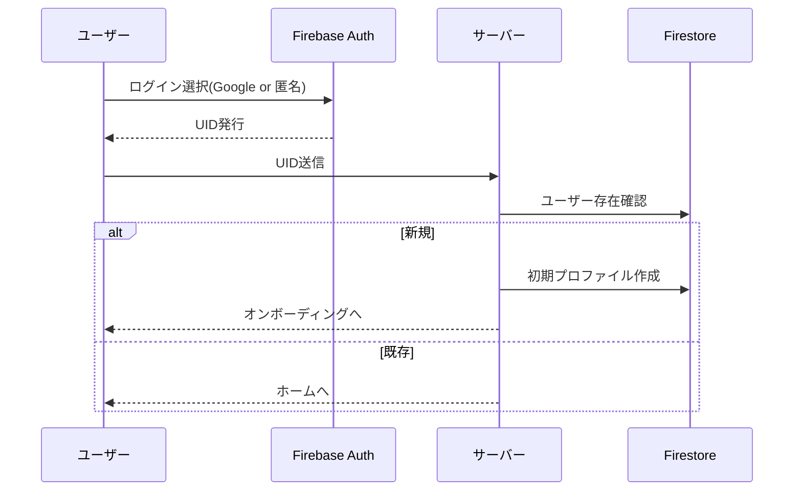
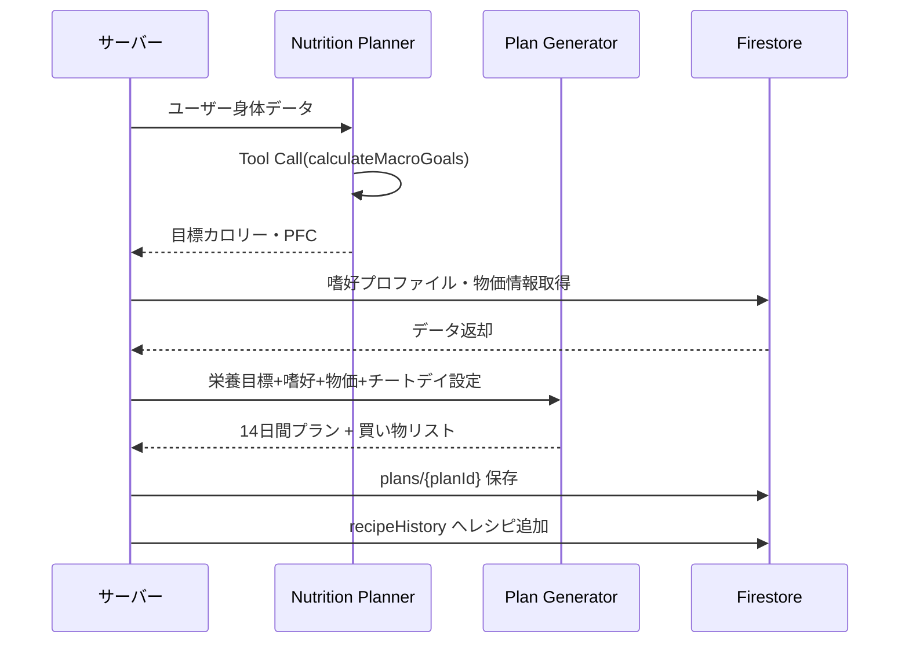
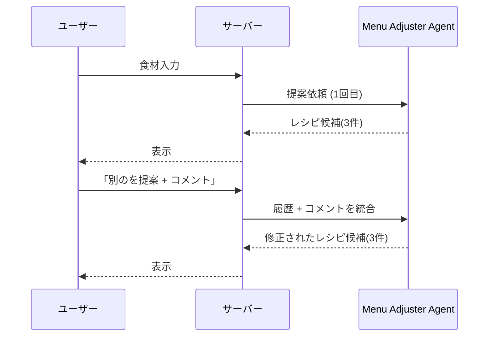
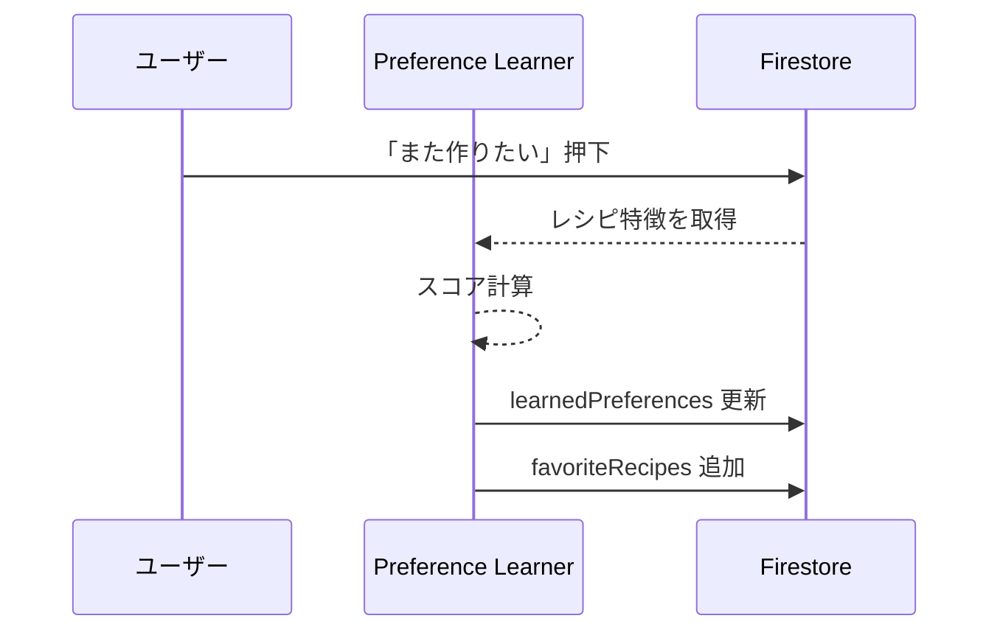
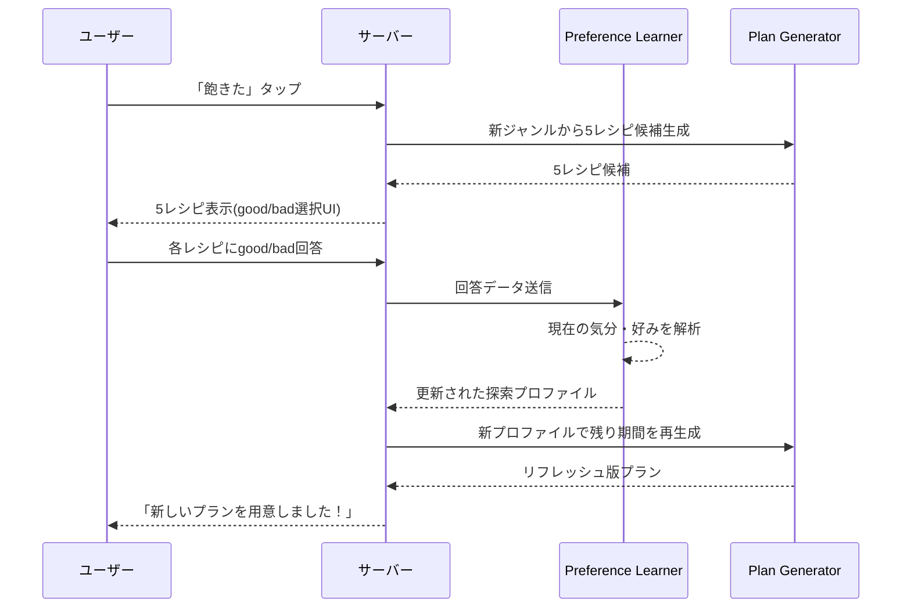

# FaveFit 詳細設計書 v2 (最終版)

## 1. ビジュアルアイデンティティ

- **テーマ**: Pop & Active (オレンジ・黄緑)
- **フォント**: Outfit / **造形**: 角丸 (1.25rem), ソフトシャドウ

---

## 2. 画面一覧

| 画面名 | 内容・主な機能 |
|---|---|
| スプラッシュ / ログイン | Google認証、匿名ゲストログインの選択 |
| オンボーディング | 目標体重、期限、食事の好み、チートデイ頻度の設定 |
| ホーム | 今日のメニュー、目標達成度、各主要機能へのナビゲーション |
| 2週間プラン | 14日間の全メニュー確認、チートデイ確認、一括再生成 |
| メメニュー詳細 | 材料・工程表示、食事完了・評価ボタン、個別レシピ差し替え |
| 買い物リスト | 食材の週単位・カテゴリ別表示、購入チェック |
| 冷蔵庫・メニュー提案 | 手持ち食材入力、AIによるレシピ提案、コメント付き再提案 |
| チートデイお祝い | 当日のモチベーションアップ、アドバイス表示 |
| **レシピ履歴** | 過去に提案された全レシピ一覧、「作った」ラベル表示、お気に入り |

---

## 3. エージェント一覧

| エージェント名 | 役割 | 活用されるシーン |
|---|---|---|
| **Nutrition Planner** | 栄養目標策定 | オンボーディング時、目標変更時 |
| **Plan Generator** | 14日間計画構築 | プラン作成、一括再生成、飽き防止 |
| **Menu Adjuster** | 臨機応変な提案 | 冷蔵庫食材からの提案、個別差し替え、再提案 |
| **Preference Learner** | ユーザー嗜好学習 | 食事完了後のFB取得、生成時のプロファイル提供 |

---

## 4. コアロジック一覧

| 機能名 | 概要 |
|---|---|
| **Tool分離 栄養計算** | PFC算出を専用TypeScript関数に委ね高速化・誤りを防止 |
| **ハイブリッド認証** | Google認証と匿名ゲストの2経路を提供しスムーズに開始 |
| **14日自動プランニング** | 栄養・嗜好・物価を考慮した42食分の全自動献立生成 |
| **コメント付き再提案** | 「別のを提案して／もっと辛く」等のFBを考慮して再生成 |
| **嗜好学習 (蓄積)** | 「また作りたい」履歴からジャンル・味付け傾向をスコア化 |
| **嗜好学習 (利用)** | 蓄積スコアを活用し、定番40%を好みで構成 |
| **飽き防止リフレッシュ** | 5レシピ提案→good/bad選択→気分解析→リフレッシュプラン生成 |
| **物価連動レシピ選定** | バッチ更新された物価情報から、安価な旬食材のレシピを優先 |
| **レシピ履歴管理** | 過去に提案されたレシピを一覧表示、作成済みラベルで管理 |

---

## 5. コアイロジック詳細設計

### 5.1 Tool分離 栄養計算
- **Tool名**: `calculateMacroGoals`
- **内部ロジック**: Mifflin-St Jeor式でBMR算出 → 活動レベル補正 → 目標PFC比率

### 5.2 ハイブリッド認証フロー


### 5.3 14日自動プランニング


### 5.4 コメント付き再提案フロー


### 5.5 嗜好学習シーケンス
#### 5.5.1 蓄積

#### 5.5.2 利用
- `Plan Generator` が `learnedPreferences` を参照し、**定番40% / 発見40% / 低コスト20%** の比率でプラン構成

### 5.6 飽き防止リフレッシュ (対話型)


### 5.7 物価連動レシピ選定
- **バッチ処理** (1日1回): 物価API等から `marketPrices/latest` を更新
- **生成時**: `Plan Generator` が `getMarketPrice` Tool を呼び出し、安価な旬食材を優先

### 5.8 レシピ履歴管理
- 過去に提案された全レシピを `recipeHistory/{userId}` に記録
- 各レシピには `cookedAt` (作成日時) フラグがあり、作った場合はラベル表示
- 履歴画面から「また作りたい」登録も可能

---

## 6. データベース設計 (Firestore)

### `users/{userId}`
```typescript
interface UserDocument {
  profile: {
    displayName: string,
    currentWeight: number,
    targetWeight: number,
    deadline: Timestamp,
    cheatDayFrequency: 'weekly' | 'biweekly',
    isGuest: boolean,
    createdAt: Timestamp
  },
  nutrition: {
    dailyCalories: number,
    pfc: { protein: number, fat: number, carbs: number }
  },
  learnedPreferences: {
    cuisines: Record<string, number>,
    flavorProfile: Record<string, number>,
    dislikedIngredients: string[]
  }
}
```

### `plans/{planId}`
```typescript
interface PlanDocument {
  userId: string,
  startDate: string,
  status: 'active' | 'completed' | 'archived',
  days: {
    [date: string]: {
      isCheatDay: boolean,
      meals: { breakfast: MealSlot, lunch: MealSlot, dinner: MealSlot },
      totalNutrition: Record<string, number>
    }
  }
}

interface MealSlot {
  recipeId: string,
  title: string,
  status: 'planned' | 'completed' | 'swapped',
  nutrition: Record<string, number>
}
```

### `recipeHistory/{userId}/recipes/{recipeId}` (新規)
```typescript
interface RecipeHistoryItem {
  id: string,
  title: string,
  tags: string[],
  proposedAt: Timestamp,     // 提案された日時
  cookedAt: Timestamp | null, // 実際に作った日時 (nullなら未作成)
  isFavorite: boolean
}
```

### `favoriteRecipes/{userId}/recipes/{recipeId}`
```typescript
interface FavoriteRecipe {
  id: string, title: string, tags: string[], addedAt: Timestamp, cookedCount: number
}
```

### `shoppingLists/{planId}` / `marketPrices/latest`
- `items`: カテゴリ別、数量、チェック / `prices`: 食材ごとの `priceScore` (1-10)

---

## 7. 技術スタック

- **Frontend**: Next.js 16, Tailwind CSS, shadcn/ui
- **Backend / AI**: Google ADK, Gemini 2.5 Flash
- **Infrastructure**: Firebase Auth, Firestore, Cloud Run
