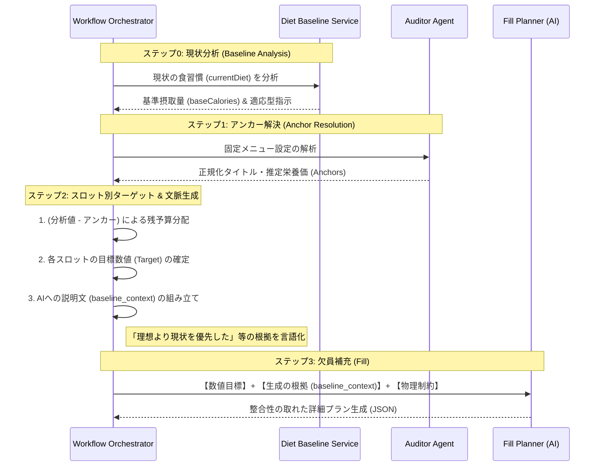

# 食事プラン生成 詳細設計書 (Anchor & Fill 戦略の強化)

## 1. 概要
本設計は、ユーザーの「固定メニュー」を確実に反映し、かつ「理想の目標」よりも「現在の食習慣（現実）」を優先したポーション制御を行う、実用的な食事プランニングを実現するものです。

### 解決する課題
- 固定メニューの名称・栄養価の不一致による差し替え問題の解消。
- 理想目標を達成するためにAIが提案する、現実離れした過剰な食事量（ポーションオーバー）の抑制。
- 食材名に調理情報（切り方など）が混入し、買い物リストの集計が正しく行われない問題の解消。

## 2. システムアーキテクチャ・処理フロー

### 2.1. 栄養目標の優先順位（Priority）
システムは以下の順序で各スロットの目標数値を決定します。
1.  **固定メニュー (Fixed)**: ユーザー設定を最優先。栄養価は Auditor が正規化して算出。
2.  **現状の食習慣 (Baseline)**: `DietBaselineService` が分析した「普段の摂取量」をベースラインとし、理想目標よりもこの数値を優先して空き枠（Auto）の目標を設定する。
3.  **理想の目標 (Target)**: 理論上の計算値。ベースラインと乖離が激しい場合は、数値の達成よりも「食べきれる量」であることを優先する。

## 3. 処理シーケンス



## 4. 詳細設計

### 4.1. スロット別目標値と文脈 (baseline_context) の生成
AIに分配を任せず、ワークフロー側で各 `Auto` スロットのターゲットを算出すると同時に、AIが納得してその数値を守るための「根拠」を生成します。

- **数値計算**: `SlotTarget = (AdaptiveBaseCalories - AnchorTotal) * SlotRatio`
- **文脈生成**: 
    - 理想目標（Target）と現状（Baseline）のギャップが激しい場合、その理由を言語化します（例：「急な減量を避けるため、普段の量に近い数値を設定しました」）。
    - ユーザーの個別制約（例：「夜は軽く」）がある場合、それも考慮した数値であることを伝えます。
- **目的**: AIの深読み（ハルシネーション）を防ぎ、提示された数値を絶対的なノルマとして認識させます。

### 4.2. ポーション制御 (物理的上限)
AIへの指示に、以下の物理的な上限を明示的に含め、数値合わせのための過剰な提案を禁止します。
- **主食（米・麺）**: 1食最大 250g (炊きあがり/茹であがり) まで。
- **主菜（肉・魚）**: 1食最大 200g (生重量) まで。
- **調整**: 数値が足りない場合は、量（Portion）を増やすのではなく、おかずの品数や脂質の質で調整する。

### 4.3. 食材名と買い物リストの整合性
買い物リストで正確に集計できるよう、AIに以下の命名規則を徹底させます。
- **食材名（name）の正規化**: 「豚肉（薄切り）」ではなく「豚肉」と出力。切り方や下処理の情報は `steps` に含める。
- **分解**: 「塩コショウで炒めた豚肉」のように複合した表現を禁止し、個別の食材と調味料に分解する。

### 4.4. データの強制整合
生成後、ワークフロー側で Auditor が算出した `Anchors` データを再度スロットに上書きし、AIによる微細な書き換え（タイトルの揺れ等）を完全に無効化します。

## 5. エージェント・プロンプト設計（抜粋）

### Fill Planner への指示構造
AIには「考える余地」を減らし、「指定された条件でレシピを作る」ことに集中させます。

```text
【ANCHOR】
- title: {resolvedTitle} / nutrition: {estimatedNutrition}
- 指示: 一字一句変えずにそのまま出力してください。

【AUTO】
- target: {calculatedTarget}
- baseline_context: {baselineContext}
- 指示: 理想値よりもベースライン（普段の量）を優先し、物理的上限を守って作成してください。

【共通制約】
- 食材名に「切り方」を含めないこと。
- 材料リストは買い物に使えるよう、個別の食材に分解すること。
```
