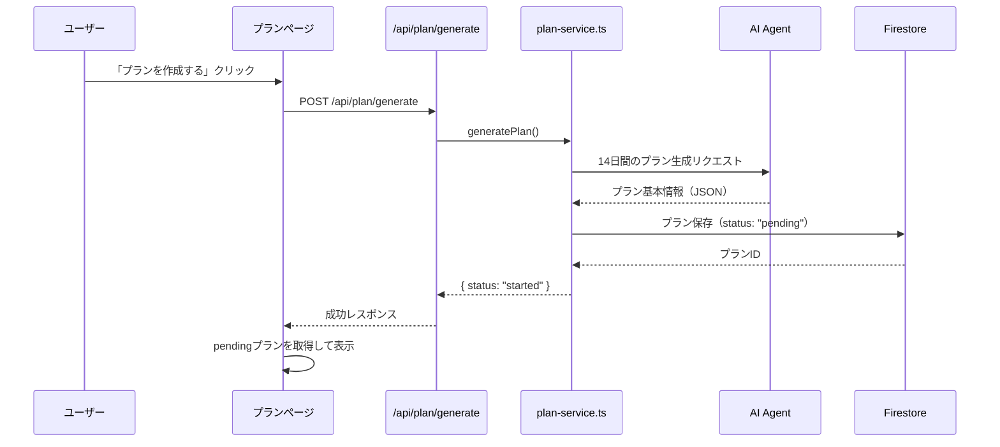
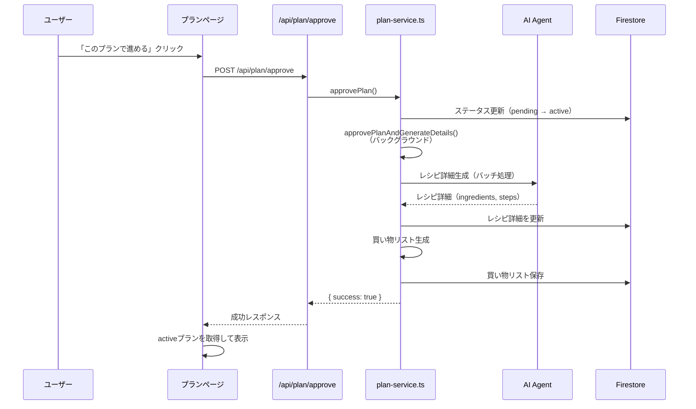
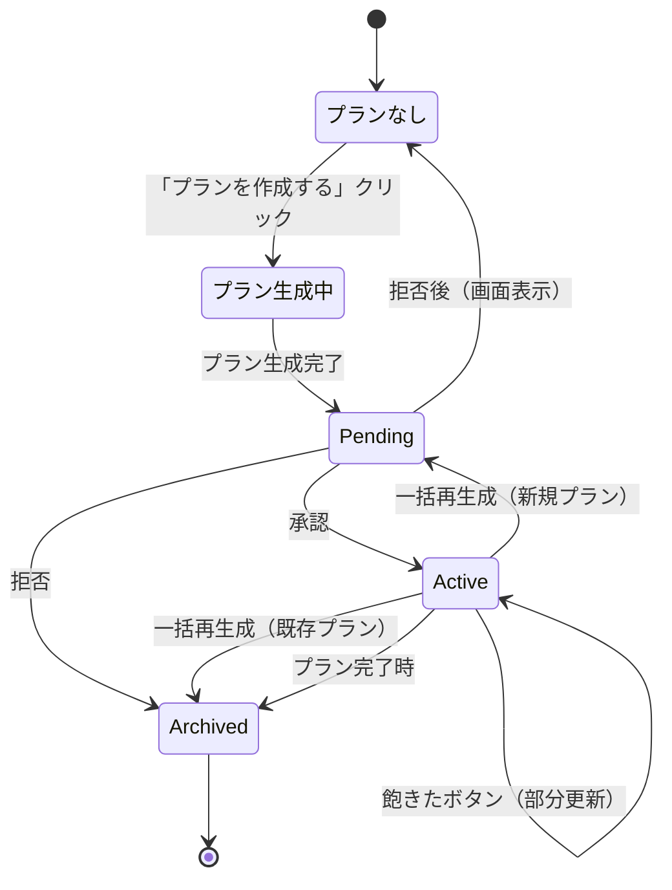

# プラン作成周りの画面フロー

## 概要

FaveFitアプリケーションにおける14日間の食事プラン作成から承認までの画面フローを説明します。

## 画面フロー図


## 画面状態の詳細

### 1. プランなし状態 (`/plan`)

**表示内容:**
- カレンダーアイコン
- 「プランがありません」メッセージ
- 「まずは2週間のプランを作成しましょう」説明文
- 「プランを作成する」ボタン

**ユーザーアクション:**
- 「プランを作成する」ボタンをクリック

**API呼び出し:**
```
POST /api/plan/generate
{
  "userId": "user-id"
}
```

**処理フロー:**
1. バックグラウンドでプラン生成を開始
2. プラン基本情報（14日分のメニュー、栄養価、タグ）を生成
3. `status: "pending"`でプランを保存
4. 買い物リストは生成しない（承認後に生成）

---

### 2. Pending状態のプラン表示

**表示内容:**

#### ヘッダー
- 「2週間プラン」タイトル
- 開始日
- 「承認待ち」バッジ

#### プラン概要カード (`PlanSummary`コンポーネント)
- **14日間の平均栄養価**
  - 平均カロリー（目標との差分%表示）
  - 平均タンパク質(g)
  - 平均脂質(g)
  - 平均炭水化物(g)
- **使用ジャンル・タグ**
  - タグの出現頻度（上位10個）
  - 例: 「和食 (8回)」「洋食 (6回)」
- **チートデイ情報**
  - チートデイの日付一覧

#### 日別カード（詳細表示）
各日のカードに以下を表示:
- 日付と曜日
- 1日の合計カロリーとPFC
- 各食事（朝・昼・夜）の詳細:
  - **レシピタイトル（全文表示）**
  - **タグ（最大3つ、バッジ表示）**
  - **栄養価（カロリー、PFC）**

#### 承認/拒否ボタン
- 「このプランで進める」ボタン（プライマリ）
- 「別のプランを生成する」ボタン（アウトライン）

**ユーザーアクション:**
- プラン概要と日別カードを確認
- 承認または拒否を選択

---

### 3. プラン承認フロー

#### 承認時 (`handleApprovePlan`)

**API呼び出し:**
```
POST /api/plan/approve
{
  "userId": "user-id",
  "planId": "plan-id"
}
```

**処理フロー:**
1. プランのステータスを`pending` → `active`に変更
2. バックグラウンドでレシピ詳細生成を開始:
   - 42食（14日 × 3食）のレシピ詳細を生成
   - バッチ処理: 5食ずつ、並列3件、バッチ間に1秒待機
   - 各レシピの`ingredients`と`steps`を生成
3. レシピ詳細生成完了後、買い物リストを生成:
   - すべてのレシピの材料を集計
   - カテゴリ別に分類・ソート
4. 成功メッセージを表示:
   - 「プランを承認しました。レシピ詳細を生成中です。完了まで1〜2分かかる場合があります。」

**画面遷移:**
- Active状態のプラン表示に切り替わる

#### 拒否時 (`handleRejectPlan`)

**確認ダイアログ:**
```
このプランを拒否しますか？
別のプランを生成できます。
```

**API呼び出し:**
```
POST /api/plan/reject
{
  "userId": "user-id",
  "planId": "plan-id"
}
```

**処理フロー:**
1. プランのステータスを`pending` → `archived`に変更
2. プランなし状態に戻る

**画面遷移:**
- プランなし画面に戻る
- 再度「プランを作成する」ボタンが表示される

---

### 4. Active状態のプラン表示

**表示内容:**

#### ヘッダー
- 「2週間プラン」タイトル
- 開始日
- アクションボタン:
  - 「飽きた」ボタン（飽き防止ダイアログを開く）
  - 「一括再生成」ボタン（14日間を一括で再生成）

#### 日別カード（簡易表示）
各日のカードに以下を表示:
- 日付と曜日
- 1日の合計カロリーのみ
- 各食事（朝・昼・夜）のリンク:
  - レシピタイトル（最大100pxで切り詰め）
  - クリックでレシピ詳細ページへ遷移

**特徴:**
- レシピ詳細（`ingredients`, `steps`）が生成済み
- 買い物リストが利用可能
- レシピ詳細ページで材料と手順を確認可能

---

### 5. 一括再生成フロー

**実装:**

#### 動作
- Active状態のプランに対してのみ動作
- `POST /api/plan/generate`を呼び出し（新規プラン生成と同じAPI）
- 既存のActiveプランを自動的にArchivedに変更
- **新しいPendingプランを作成**
- **承認フローに入る**

#### 処理フロー
1. 確認ダイアログを表示:
   ```
   14日間のプランを一括で再生成しますか？
   現在のプランはアーカイブされ、新しいプランが生成されます。
   生成後、プランを確認して承認してください。
   ```
2. `POST /api/plan/generate`を呼び出し
3. バックグラウンドで新しいプランを生成:
   - 既存のActiveプランをArchivedに変更
   - 新しいPendingプランを作成（基本情報のみ）
4. Pendingプランを表示:
   - プラン概要カード
   - 日別カード詳細表示
   - 承認/拒否ボタン
5. ユーザーがプランを確認して承認
6. 承認後にレシピ詳細を生成

**特徴:**
- ✅ **一括再生成も承認フローを経由します**
- ✅ ユーザーが新しいプランを確認・承認できます
- ✅ 承認後にレシピ詳細が生成されます
- ✅ 新規プラン作成と同じフローで統一されています

---

## データフロー

### プラン生成時



### プラン承認時



---

## 状態遷移図



---

## 主要なコンポーネント

### `PlanPage` (`src/app/plan/page.tsx`)
- プラン表示のメインコンポーネント
- 状態管理: `activePlan`, `pendingPlan`
- 条件分岐: `isPending`で表示を切り替え

### `PlanSummary` (`src/components/plan-summary.tsx`)
- プラン概要カードコンポーネント
- 統計情報、栄養バランス、タグ分析を表示
- Pending状態の時のみ表示

### `DayCard`
- 日別カードコンポーネント
- `isPending`プロップで表示モードを切り替え:
  - `true`: 詳細表示（タイトル全文、タグ、PFC）
  - `false`: 簡易表示（タイトル切り詰め、カロリーのみ）

---

## API エンドポイント

### `POST /api/plan/generate`
プラン生成を開始

**リクエスト:**
```json
{
  "userId": "user-id"
}
```

**レスポンス:**
```json
{
  "status": "started",
  "message": "プラン生成を開始しました"
}
```

### `POST /api/plan/approve`
プランを承認

**リクエスト:**
```json
{
  "userId": "user-id",
  "planId": "plan-id"
}
```

**レスポンス:**
```json
{
  "success": true,
  "message": "プランを承認しました。レシピ詳細を生成中です。"
}
```

### `POST /api/plan/reject`
プランを拒否

**リクエスト:**
```json
{
  "userId": "user-id",
  "planId": "plan-id"
}
```

**レスポンス:**
```json
{
  "success": true,
  "message": "プランを拒否しました。"
}
```

---

## 注意事項

1. **レシピ詳細生成のタイミング**
   - 承認後にバックグラウンドで生成されるため、承認直後はレシピ詳細が未生成の可能性がある
   - ユーザーには「完了まで1〜2分かかる場合があります」と通知

2. **バッチ処理の制限**
   - 5食ずつ、並列3件、バッチ間に1秒待機
   - APIレート制限を考慮した設計

3. **買い物リスト生成**
   - レシピ詳細がすべて生成されてから買い物リストを生成
   - 材料を集計してカテゴリ別に分類

4. **既存プランとの互換性**
   - `active`状態のプランは既存の表示を維持
   - `pending`状態のプランのみ承認UIを表示
