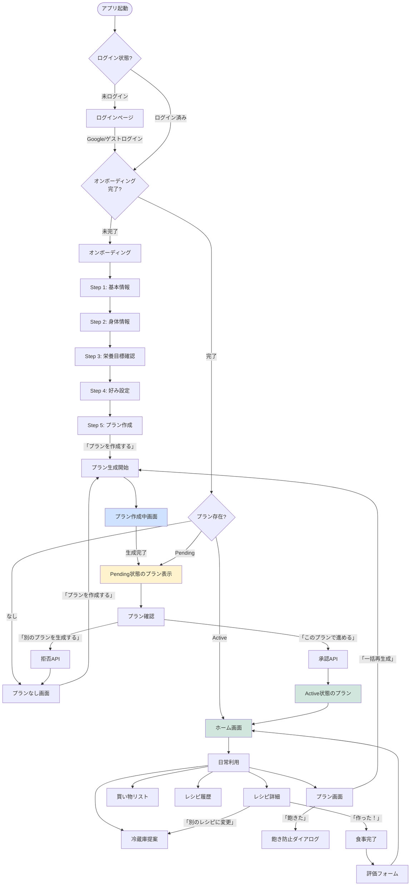
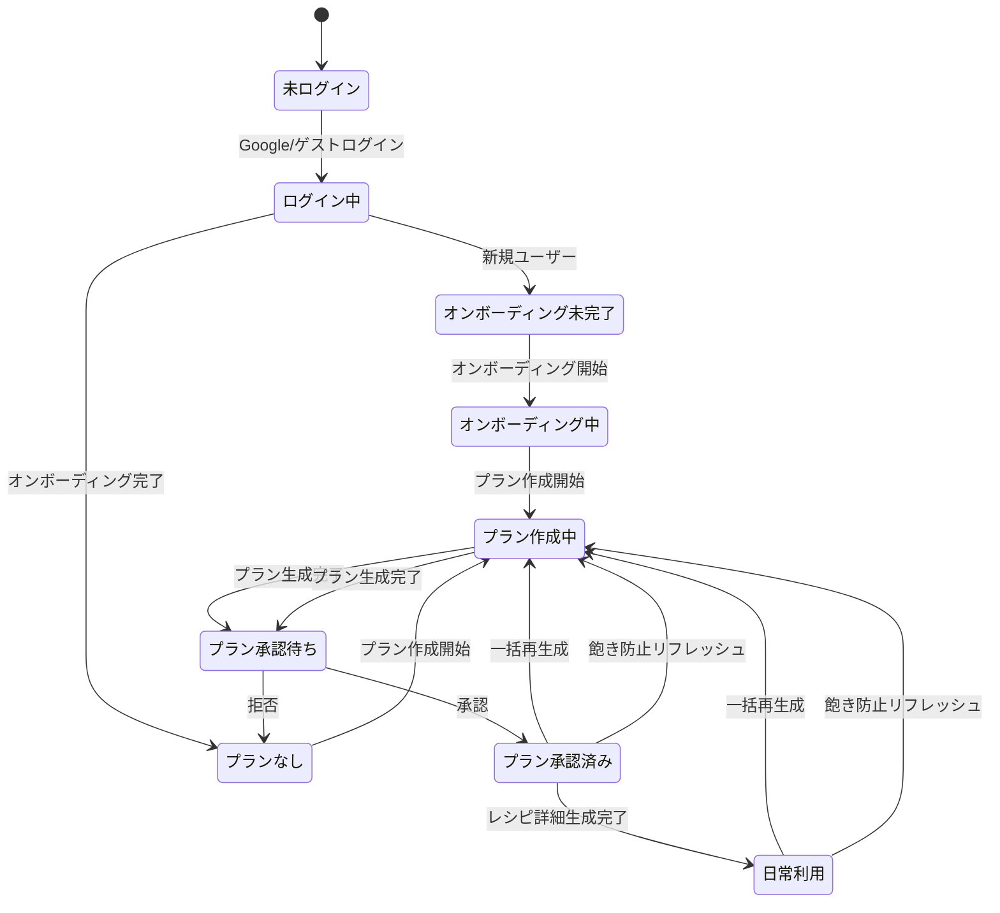
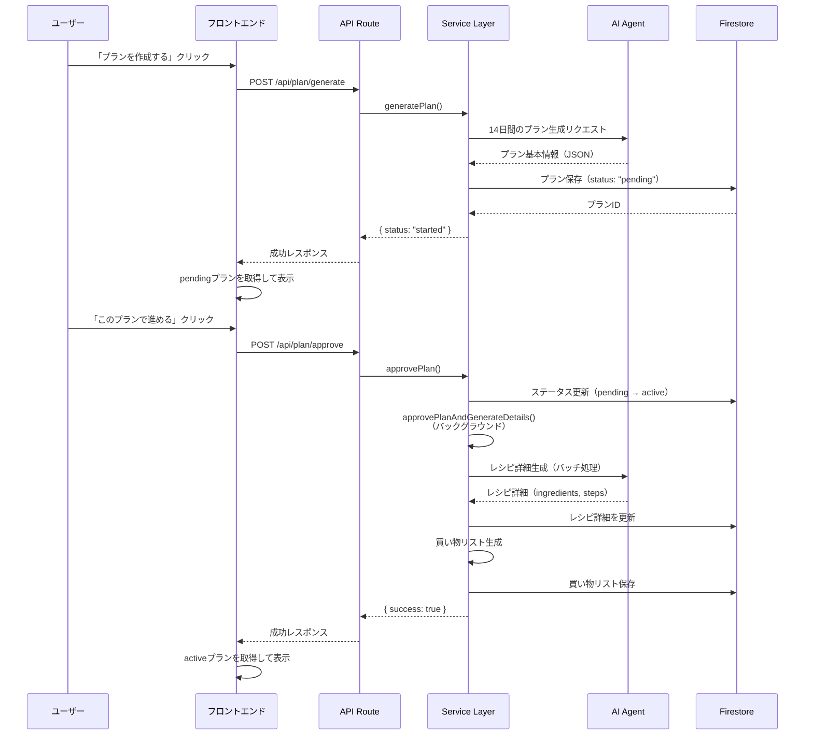

# FaveFit ユーザーフロー整理ドキュメント

## 概要

このドキュメントは、FaveFitアプリケーションの全ユーザーフローを整理し、各画面の状態とボタン押下後の動作を明確に記載したものです。ユーザーが期待する動作と実際の画面動作の差異を明確にすることを目的としています。

---

## 全体フロー図



---

## フェーズ別詳細

### フェーズ1: 開始フェーズ（ログイン → オンボーディング）

#### 1.1 ログインページ (`/`)

**画面状態:**
- FaveFitのロゴと説明文
- 「Googleでログイン」ボタン
- 「ゲストとして続ける」ボタン

**ユーザーアクション:**
- Googleログインボタンをクリック
- ゲストログインボタンをクリック

**ボタン押下後の動作:**

| ボタン | 処理内容 | API呼び出し | 画面遷移 |
|--------|---------|------------|---------|
| Googleでログイン | Firebase AuthでGoogle認証を実行 | `signInWithPopup(auth, googleProvider)` | `/home`へリダイレクト |
| ゲストとして続ける | Firebase Authで匿名認証を実行 | `signInAnonymously(auth)` | `/home`へリダイレクト |

**注意事項:**
- ログイン成功後、`onAuthStateChanged`でユーザー状態を監視
- ユーザーが存在する場合、`getOrCreateUser()`でプロフィールを取得
- オンボーディング未完了の場合は`/onboarding`へ、完了済みの場合は`/home`へ遷移

---

#### 1.2 オンボーディングページ (`/onboarding`)

**画面状態:**

**Step 1: 基本情報**
- ニックネーム入力
- 現在の体重・目標体重入力
- 目標達成期限選択
- チートデイ頻度選択（週1回 / 2週に1回）
- プロフィール設定済みの場合はスキップオプション表示

**Step 2: 身体情報**
- 年齢・性別・身長入力
- 活動レベル選択
- 目標選択（減量/維持/増量）

**Step 3: 栄養目標確認**
- AIが計算した1日の目標カロリー表示
- PFC（タンパク質・脂質・炭水化物）表示
- 戦略サマリー表示

**Step 4: 好み設定**
- アレルギー・苦手な食材入力
- 好きな食材入力
- 好きなジャンル選択（複数選択可）
- 味付けの好み選択（さっぱり/普通/こってり）
- 料理スキル選択
- 調理時間の目安選択

**Step 5: プラン作成**
- 「準備完了！」メッセージ
- 「プランを作成する」ボタン

**プラン作成中画面:**
- ローディングスピナー
- 「プラン作成中...」メッセージ
- 「1〜2分程度かかります」説明
- 「このページを閉じても問題ありません」説明
- 「ホームに戻る」ボタン

**ユーザーアクション:**
- 各ステップで「次へ」ボタンをクリック
- Step 2で「AIで計算」ボタンをクリック
- Step 4で「次へ」ボタンをクリック（プロフィール保存）
- Step 5で「プランを作成する」ボタンをクリック
- プロフィール設定済みの場合は「プラン作成へ進む」ボタンでStep 5へスキップ

**ボタン押下後の動作:**

| ボタン | 処理内容 | API呼び出し | 画面遷移 |
|--------|---------|------------|---------|
| 次へ（Step 1） | 次のステップへ進む | なし | Step 2へ |
| AIで計算（Step 2） | 栄養目標を計算 | `POST /api/user/calculate-nutrition` | Step 3へ（栄養結果を表示） |
| 次へ（Step 3） | 次のステップへ進む | なし | Step 4へ |
| 次へ（Step 4） | プロフィールを保存、初期嗜好を設定 | `updateUserProfile()`, `updateDoc()` | Step 5へ |
| プランを作成する（Step 5） | オンボーディング完了をマーク、プラン生成を開始 | `completeOnboarding()`, `POST /api/plan/generate` | プラン作成中画面へ |
| プラン作成へ進む（スキップ） | Step 5へ直接遷移 | なし | Step 5へ |
| ホームに戻る（作成中） | ホーム画面へ遷移 | なし | `/home`へ |

**API詳細:**

**`POST /api/user/calculate-nutrition`**
```json
{
  "userId": "user-id",
  "profile": {
    "age": 30,
    "gender": "male",
    "height_cm": 170,
    "weight_kg": 65,
    "activity_level": "moderate",
    "goal": "lose"
  }
}
```

**`POST /api/plan/generate`**
```json
{
  "userId": "user-id"
}
```

**処理フロー:**
1. オンボーディング完了フラグを`true`に設定
2. プラン生成をバックグラウンドで開始
3. プロフィールの`planCreationStatus`を`"creating"`に設定
4. プラン生成完了後、`status: "pending"`でプランを保存
5. 5秒ごとにプロフィールとプランを再取得して状態をチェック

---

### フェーズ2: プラン作成フェーズ（プラン生成 → 承認待ち）

#### 2.1 プランなし画面 (`/plan`)

**画面状態:**
- カレンダーアイコン
- 「プランがありません」メッセージ
- 「まずは2週間のプランを作成しましょう」説明文
- 「プランを作成する」ボタン

**ユーザーアクション:**
- 「プランを作成する」ボタンをクリック

**ボタン押下後の動作:**

| ボタン | 処理内容 | API呼び出し | 画面遷移 |
|--------|---------|------------|---------|
| プランを作成する | プラン生成を開始 | `POST /api/plan/generate` | プラン作成中画面 → Pending状態のプラン表示 |

**処理フロー:**
1. `POST /api/plan/generate`を呼び出し
2. バックグラウンドでプラン生成を開始
3. プラン基本情報（14日分のメニュー、栄養価、タグ）を生成
4. `status: "pending"`でプランを保存
5. プランを再取得してPending状態のプランを表示

---

#### 2.2 プラン作成中画面

**表示場所:**
- `/onboarding`（Step 5でプラン作成開始後）
- `/plan`（プラン生成中）
- `/home`（プラン生成中）

**画面状態:**
- ローディングスピナー
- 「プラン作成中...」メッセージ
- 「AIが14日間の食事プランを生成しています」説明
- 「作成には1〜2分かかります」説明
- 「このページを開いたままお待ちいただくか、しばらくしてから再度アクセスしてください」説明
- 「ホームに戻る」ボタン（オンボーディング画面の場合）

**処理フロー:**
- `profile.planCreationStatus === "creating"`の場合に表示
- 5秒ごとにプロフィールとプランを再取得
- プラン生成完了後、自動的にPending状態のプラン表示へ切り替わり

---

#### 2.3 Pending状態のプラン表示 (`/plan`)

**画面状態:**

**ヘッダー:**
- 「2週間プラン」タイトル
- 開始日
- 「承認待ち」バッジ

**プラン概要カード（`PlanSummary`コンポーネント）:**
- 14日間の平均栄養価
  - 平均カロリー（目標との差分%表示）
  - 平均タンパク質(g)
  - 平均脂質(g)
  - 平均炭水化物(g)
- 使用ジャンル・タグ（出現頻度上位10個）
- チートデイ情報（チートデイの日付一覧）

**日別カード（詳細表示）:**
各日のカードに以下を表示:
- 日付と曜日
- 1日の合計カロリーとPFC
- 各食事（朝・昼・夜）の詳細:
  - レシピタイトル（全文表示）
  - タグ（最大3つ、バッジ表示）
  - 栄養価（カロリー、PFC）

**承認/拒否ボタン:**
- 「このプランで進める」ボタン（プライマリ）
- 「別のプランを生成する」ボタン（アウトライン）

**ユーザーアクション:**
- プラン概要と日別カードを確認
- 「このプランで進める」ボタンをクリック
- 「別のプランを生成する」ボタンをクリック

**ボタン押下後の動作:**

| ボタン | 処理内容 | API呼び出し | 画面遷移 |
|--------|---------|------------|---------|
| このプランで進める | プランを承認し、レシピ詳細生成を開始 | `POST /api/plan/approve` | Active状態のプラン表示へ |
| 別のプランを生成する | プランを拒否し、アーカイブ | `POST /api/plan/reject` | プランなし画面へ |

**API詳細:**

**`POST /api/plan/approve`**
```json
{
  "userId": "user-id",
  "planId": "plan-id"
}
```

**処理フロー（承認時）:**
1. プランのステータスを`pending` → `active`に変更
2. バックグラウンドでレシピ詳細生成を開始:
   - 42食（14日 × 3食）のレシピ詳細を生成
   - バッチ処理: 5食ずつ、並列3件、バッチ間に1秒待機
   - 各レシピの`ingredients`と`steps`を生成
3. レシピ詳細生成完了後、買い物リストを生成:
   - すべてのレシピの材料を集計
   - カテゴリ別に分類・ソート
4. 成功メッセージを表示:
   - 「プランを承認しました。レシピ詳細を生成中です。完了まで1〜2分かかる場合があります。」
5. Active状態のプランを取得して表示

**`POST /api/plan/reject`**
```json
{
  "userId": "user-id",
  "planId": "plan-id"
}
```

**処理フロー（拒否時）:**
1. 確認ダイアログを表示:
   ```
   このプランを拒否しますか？
   別のプランを生成できます。
   ```
2. 確認後、プランのステータスを`pending` → `archived`に変更
3. プランなし画面に戻る
4. 再度「プランを作成する」ボタンが表示される

---

### フェーズ3: 承認フェーズ（承認/拒否 → Active化）

#### 3.1 承認後の処理

**バックグラウンド処理:**
1. レシピ詳細生成（`approvePlanAndGenerateDetails()`）
   - 42食分のレシピ詳細をバッチ処理で生成
   - 各レシピに`ingredients`と`steps`を追加
2. 買い物リスト生成
   - すべてのレシピの材料を集計
   - カテゴリ別に分類・ソート
   - `shoppingLists/{planId}`に保存

**画面遷移:**
- Pending状態のプラン表示 → Active状態のプラン表示
- 日別カードが詳細表示から簡易表示に切り替わる

---

#### 3.2 Active状態のプラン表示 (`/plan`)

**画面状態:**

**ヘッダー:**
- 「2週間プラン」タイトル
- 開始日
- アクションボタン:
  - 「飽きた」ボタン（飽き防止ダイアログを開く）
  - 「一括再生成」ボタン（14日間を一括で再生成）

**日別カード（簡易表示）:**
各日のカードに以下を表示:
- 日付と曜日
- 1日の合計カロリーのみ
- 各食事（朝・昼・夜）のリンク:
  - レシピタイトル（最大100pxで切り詰め）
  - クリックでレシピ詳細ページへ遷移

**特徴:**
- レシピ詳細（`ingredients`, `steps`）が生成済み
- 買い物リストが利用可能
- レシピ詳細ページで材料と手順を確認可能

**ユーザーアクション:**
- 日別カードのレシピタイトルをクリック（レシピ詳細へ）
- 「飽きた」ボタンをクリック
- 「一括再生成」ボタンをクリック

**ボタン押下後の動作:**

| ボタン | 処理内容 | API呼び出し | 画面遷移 |
|--------|---------|------------|---------|
| 飽きた | 飽き防止ダイアログを開く | なし | ダイアログ表示 |
| 一括再生成 | 確認ダイアログ表示 → 新規プラン生成 | `POST /api/plan/generate` | Pending状態のプラン表示へ |

**一括再生成の処理フロー:**
1. 確認ダイアログを表示:
   ```
   14日間のプランを一括で再生成しますか？
   現在のプランはアーカイブされ、新しいプランが生成されます。
   生成後、プランを確認して承認してください。
   ```
2. `POST /api/plan/generate`を呼び出し
3. 既存のActiveプランをArchivedに変更
4. 新しいPendingプランを作成（基本情報のみ）
5. Pendingプランを表示:
   - プラン概要カード
   - 日別カード詳細表示
   - 承認/拒否ボタン
6. ユーザーがプランを確認して承認
7. 承認後にレシピ詳細を生成

---

### フェーズ4: 日常利用フェーズ

#### 4.1 ホーム画面 (`/home`)

**画面状態:**

**プランがない場合:**
- FaveFitロゴ
- 「2週間の食事プランを作成して、ダイエットを楽しく始めましょう！」メッセージ
- 「プランを作成する」または「はじめる」ボタン

**プラン作成中の場合:**
- ローディングスピナー
- 「プラン作成中...」メッセージ
- 「AIが14日間の食事プランを生成しています」説明

**チートデイの場合:**
- チートデイカード（グラデーション背景）
- 「🎉 CHEAT DAY!」メッセージ
- 「今日は好きなものを楽しむ日。罪悪感なく、心も体もリフレッシュ！」説明

**通常のホーム画面:**
- 「今日のメニュー」タイトル
- 目標カロリーと残りカロリー表示
- 進捗バー（完了した食事数/3）
- 食事カード（朝食・昼食・夕食）:
  - 食事タイプ（🍳 朝食、🍱 昼食、🍽️ 夕食）
  - レシピタイトル
  - カロリー
  - 完了済みバッジ（完了している場合）
- 「🥗 別のメニューを提案」ボタン

**ユーザーアクション:**
- 食事カードをクリック（レシピ詳細へ）
- 「別のメニューを提案」ボタンをクリック
- 「プランを作成する」ボタンをクリック（プランがない場合）

**ボタン押下後の動作:**

| ボタン | 処理内容 | API呼び出し | 画面遷移 |
|--------|---------|------------|---------|
| プランを作成する | プラン作成ページへ遷移 | なし | `/plan`へ |
| はじめる | オンボーディングページへ遷移 | なし | `/onboarding`へ |
| 食事カード | レシピ詳細ページへ遷移 | なし | `/recipe/{recipeId}`へ |
| 別のメニューを提案 | 冷蔵庫提案ページへ遷移 | なし | `/fridge`へ |

---

#### 4.2 レシピ詳細ページ (`/recipe/[id]`)

**画面状態:**

**ヘッダー:**
- 戻るボタン
- レシピタイトル
- お気に入りボタン（ハートアイコン）

**栄養情報:**
- カロリー（kcal）
- タンパク質（g）
- 脂質（g）
- 炭水化物（g）

**タグ:**
- レシピのタグ（バッジ表示）

**材料・手順:**
- 材料リスト（カード）
- 手順リスト（カード）

**アクションボタン（未完了時）:**
- 「作った！」ボタン（プライマリ）
- 「別のレシピに変更」ボタン（アウトライン）

**アクションボタン（完了済み時）:**
- 「完了済み」バッジ
- 「評価する」ボタン

**評価フォーム（表示時）:**
- 評価フォームコンポーネント

**ユーザーアクション:**
- 「作った！」ボタンをクリック
- 「別のレシピに変更」ボタンをクリック
- 「評価する」ボタンをクリック
- お気に入りボタンをクリック
- 戻るボタンをクリック

**ボタン押下後の動作:**

| ボタン | 処理内容 | API呼び出し | 画面遷移 |
|--------|---------|------------|---------|
| 作った！ | レシピを完了済みにマーク | `markAsCooked()` | 評価フォームを表示 |
| 別のレシピに変更 | 冷蔵庫提案ページへ遷移（差し替えモード） | なし | `/fridge?swap={recipeId}&planId={planId}&date={date}&mealType={mealType}`へ |
| 評価する | 評価フォームを表示 | なし | 評価フォーム表示 |
| お気に入り | また作りたいリストに追加 | `addToFavorites()` | なし（アラート表示） |
| 戻る | 前のページへ戻る | なし | `router.back()` |

**処理フロー（作った！ボタン）:**
1. `markAsCooked(userId, recipeId)`を呼び出し
2. レシピの`status`を`"completed"`に更新
3. `recipeHistory`に`cookedAt`を記録
4. 評価フォームを表示

**処理フロー（別のレシピに変更）:**
1. URLパラメータ付きで冷蔵庫提案ページへ遷移
2. 差し替えモードでレシピ提案を表示
3. レシピ選択後、`POST /api/recipe/swap-meal`を呼び出し
4. プラン内の該当レシピを差し替え
5. ホーム画面へ遷移

**API詳細:**

**`POST /api/recipe/swap-meal`**
```json
{
  "userId": "user-id",
  "planId": "plan-id",
  "date": "2026-01-24",
  "mealType": "breakfast",
  "newMeal": {
    "recipeId": "recipe-id",
    "title": "レシピタイトル",
    "status": "swapped",
    "nutrition": {...},
    "tags": [...],
    "ingredients": [...],
    "steps": [...]
  }
}
```

---

#### 4.3 買い物リストページ (`/shopping`)

**画面状態:**

**買い物リストがない場合:**
- ショッピングカートアイコン
- 「買い物リストがありません」メッセージ
- 「プランを作成すると自動で買い物リストが生成されます」説明

**買い物リストがある場合:**
- 「買い物リスト」タイトル
- 購入済みアイテム数/総アイテム数表示
- Complete!バッジ（すべて購入済みの場合）
- 表示モード切り替えタブ:
  - カテゴリ別
  - 週単位
- カテゴリ別表示:
  - カテゴリ名とアイテム数
  - 展開/折りたたみ可能
  - 各アイテム:
    - チェックボックス
    - 食材名
    - 数量
    - チェック済みの場合は取り消し線

**ユーザーアクション:**
- カテゴリをクリック（展開/折りたたみ）
- アイテムのチェックボックスをクリック
- 表示モードを切り替え

**ボタン押下後の動作:**

| アクション | 処理内容 | API呼び出し | 画面遷移 |
|-----------|---------|------------|---------|
| カテゴリクリック | カテゴリを展開/折りたたみ | なし | なし |
| チェックボックス | アイテムの購入状態を切り替え | `toggleItemCheck()`（実装予定） | なし（楽観的UI更新） |
| 表示モード切り替え | カテゴリ別/週単位を切り替え | なし | なし |

**注意事項:**
- チェックボックスの状態更新は現在楽観的UI更新のみ
- 実際のデータベース更新は今後実装予定

---

#### 4.4 冷蔵庫提案ページ (`/fridge`)

**画面状態:**

**通常モード:**
- 「冷蔵庫からメニュー提案」タイトル
- 「手元にある食材から、AIがレシピを提案します」説明
- 食材入力フォーム:
  - 食材入力テキストエリア
  - 希望コメント入力テキストエリア
  - 「レシピを提案してもらう」ボタン

**差し替えモード（URLパラメータあり）:**
- 「プラン内のレシピを差し替えるレシピを選んでください」説明

**提案結果表示:**
- 「3つのレシピを提案します」メッセージ
- レシピカード（3件）:
  - レシピタイトル
  - 説明文
  - タグ（バッジ）
  - 追加で必要な食材（ある場合）
- 再提案ボタン:
  - 「さっぱり系で」ボタン
  - 「こってり系で」ボタン
- 「食材を入力し直す」ボタン

**ユーザーアクション:**
- 食材を入力して「レシピを提案してもらう」ボタンをクリック
- レシピカードをクリック
- 再提案ボタンをクリック
- 「食材を入力し直す」ボタンをクリック

**ボタン押下後の動作:**

| ボタン | 処理内容 | API呼び出し | 画面遷移 |
|--------|---------|------------|---------|
| レシピを提案してもらう | レシピ提案を生成 | `POST /api/menu` | 提案結果を表示 |
| レシピカード（通常モード） | レシピ詳細ページへ遷移 | なし | `/recipe/{recipeId}`へ |
| レシピカード（差し替えモード） | レシピをプランに差し替え | `POST /api/recipe/swap-meal` | `/home`へ |
| さっぱり系で | コメント付きで再提案 | `POST /api/menu` | 新しい提案結果を表示 |
| こってり系で | コメント付きで再提案 | `POST /api/menu` | 新しい提案結果を表示 |
| 食材を入力し直す | フォームをリセット | なし | 入力フォーム表示 |

**API詳細:**

**`POST /api/menu`**
```json
{
  "userId": "user-id",
  "ingredients": ["鶏もも肉", "キャベツ", "にんじん"],
  "comment": "さっぱりしたもの",
  "previousSuggestions": ["レシピ1", "レシピ2"]
}
```

**処理フロー（レシピ選択 - 差し替えモード）:**
1. レシピをMealSlot形式に変換
2. `POST /api/recipe/swap-meal`を呼び出し
3. プラン内の該当レシピを差し替え
4. アラート表示: 「レシピを差し替えました！」
5. ホーム画面へ遷移

---

#### 4.5 レシピ履歴ページ (`/history`)

**画面状態:**

**ヘッダー:**
- 「レシピ履歴」タイトル

**タブ:**
- 「すべて」タブ
- 「また作りたい」タブ

**すべてタブ:**
- レシピカード一覧:
  - レシピタイトル
  - 「作った」バッジ（作成済みの場合）
  - お気に入りアイコン（お気に入り登録済みの場合）
  - タグ（最大3つ）
  - カロリー
  - 「また作りたい」ボタン（お気に入り未登録の場合）

**また作りたいタブ:**
- お気に入りレシピカード一覧:
  - ハートアイコン
  - レシピタイトル
  - タグ（最大3つ）
  - 作成回数

**ユーザーアクション:**
- レシピカードをクリック（レシピ詳細へ）
- 「また作りたい」ボタンをクリック
- タブを切り替え

**ボタン押下後の動作:**

| ボタン | 処理内容 | API呼び出し | 画面遷移 |
|--------|---------|------------|---------|
| レシピカード | レシピ詳細ページへ遷移 | なし | `/recipe/{recipeId}`へ |
| また作りたい | お気に入りリストに追加 | `addToFavorites()` | ページリロード |

**処理フロー（また作りたいボタン）:**
1. `addToFavorites(userId, recipeId)`を呼び出し
2. `favoriteRecipes`にレシピを追加
3. レシピ履歴の`isFavorite`を`true`に更新
4. ページをリロードして状態を更新

---

#### 4.6 プラン画面（Active状態） (`/plan`)

**画面状態:**
- [フェーズ3の「Active状態のプラン表示」を参照]

**追加アクション:**
- 「飽きた」ボタン → 飽き防止ダイアログ

---

#### 4.7 飽き防止ダイアログ

**画面状態:**

**ステップ1: ローディング**
- ローディングスピナー
- 「新しいレシピを提案しています...」メッセージ

**ステップ2: レシピ選択**
- 「気分に合うレシピを選んでください」メッセージ
- 5つのレシピカード:
  - レシピタイトル
  - 説明文
  - タグ
  - Good/Badボタン
- 「リフレッシュする」ボタン

**ステップ3: リフレッシュ中**
- ローディングスピナー
- 「プランをリフレッシュしています...」メッセージ

**ステップ4: 完了**
- 「新しいプランを用意しました！」メッセージ
- 2秒後に自動的にダイアログを閉じてプランを更新

**ユーザーアクション:**
- Good/Badボタンをクリック
- 「リフレッシュする」ボタンをクリック
- 「閉じる」ボタンをクリック

**ボタン押下後の動作:**

| ボタン | 処理内容 | API呼び出し | 画面遷移 |
|--------|---------|------------|---------|
| Good/Bad | レシピの評価を記録 | なし | なし（状態更新） |
| リフレッシュする | フィードバックを送信してプランをリフレッシュ | `POST /api/plan/refresh-with-feedback` | リフレッシュ中 → 完了 |
| 閉じる | ダイアログを閉じる | なし | ダイアログを閉じる |

**API詳細:**

**`POST /api/plan/suggest-boredom-recipes`**
```json
{
  "userId": "user-id"
}
```

**`POST /api/plan/refresh-with-feedback`**
```json
{
  "userId": "user-id",
  "goodRecipes": ["レシピ1", "レシピ2"],
  "badRecipes": ["レシピ3"]
}
```

**処理フロー:**
1. 5つの新しいレシピ候補を取得
2. ユーザーがGood/Badを選択
3. フィードバックを送信してプランをリフレッシュ
4. 気分解析を行い、残り期間のプランを再生成
5. プランを更新して表示

---

#### 4.8 チートデイページ (`/cheat-day`)

**画面状態:**

**チートデイでない場合:**
- スパークルアイコン
- 「今日はチートデイではありません」メッセージ
- 「次のチートデイまで、もう少し頑張りましょう！」説明
- 「プランを確認する」ボタン

**チートデイの場合:**
- 紙吹雪アニメーション（自動実行）
- 「🎉 CHEAT DAY!」メッセージ
- 「今日は好きなものを楽しむ日」説明
- チートデイカード:
  - 「頑張った自分へのご褒美です。罪悪感なく、食事を楽しんでください！」メッセージ
  - アイコン（ピザ、焼肉、スイーツ）
- チートデイのコツカード:
  - コツのリスト
- 「ホームに戻る」ボタン

**ユーザーアクション:**
- 「プランを確認する」ボタンをクリック（チートデイでない場合）
- 「ホームに戻る」ボタンをクリック（チートデイの場合）

**ボタン押下後の動作:**

| ボタン | 処理内容 | API呼び出し | 画面遷移 |
|--------|---------|------------|---------|
| プランを確認する | プラン画面へ遷移 | なし | `/plan`へ |
| ホームに戻る | ホーム画面へ遷移 | なし | `/home`へ |

---

## 画面別アクション一覧表

### ログインページ (`/`)

| ボタン/アクション | 処理内容 | 画面遷移 |
|------------------|---------|---------|
| Googleでログイン | Google認証を実行 | `/home`へ |
| ゲストとして続ける | 匿名認証を実行 | `/home`へ |

---

### オンボーディングページ (`/onboarding`)

| ボタン/アクション | 処理内容 | 画面遷移 |
|------------------|---------|---------|
| 次へ（Step 1） | Step 2へ進む | Step 2 |
| AIで計算（Step 2） | 栄養目標を計算 | Step 3 |
| 次へ（Step 3） | Step 4へ進む | Step 4 |
| 次へ（Step 4） | プロフィール保存 | Step 5 |
| プランを作成する（Step 5） | プラン生成開始 | プラン作成中画面 |
| プラン作成へ進む（スキップ） | Step 5へ直接遷移 | Step 5 |
| ホームに戻る（作成中） | ホームへ遷移 | `/home` |

---

### プラン画面 (`/plan`)

| ボタン/アクション | 処理内容 | 画面遷移 |
|------------------|---------|---------|
| プランを作成する（プランなし時） | プラン生成開始 | Pending状態表示 |
| このプランで進める（Pending時） | プランを承認 | Active状態表示 |
| 別のプランを生成する（Pending時） | プランを拒否 | プランなし画面 |
| 飽きた（Active時） | 飽き防止ダイアログを開く | ダイアログ表示 |
| 一括再生成（Active時） | 新規プラン生成 | Pending状態表示 |
| レシピタイトル（Active時） | レシピ詳細へ遷移 | `/recipe/{recipeId}` |

---

### ホーム画面 (`/home`)

| ボタン/アクション | 処理内容 | 画面遷移 |
|------------------|---------|---------|
| プランを作成する | プラン画面へ遷移 | `/plan` |
| はじめる | オンボーディングへ遷移 | `/onboarding` |
| 食事カード | レシピ詳細へ遷移 | `/recipe/{recipeId}` |
| 別のメニューを提案 | 冷蔵庫提案へ遷移 | `/fridge` |

---

### レシピ詳細ページ (`/recipe/[id]`)

| ボタン/アクション | 処理内容 | 画面遷移 |
|------------------|---------|---------|
| 作った！ | レシピを完了済みにマーク | 評価フォーム表示 |
| 別のレシピに変更 | 冷蔵庫提案へ遷移（差し替えモード） | `/fridge?swap=...` |
| 評価する | 評価フォームを表示 | 評価フォーム表示 |
| お気に入り | お気に入りリストに追加 | なし |
| 戻る | 前のページへ戻る | `router.back()` |

---

### 買い物リストページ (`/shopping`)

| ボタン/アクション | 処理内容 | 画面遷移 |
|------------------|---------|---------|
| カテゴリクリック | 展開/折りたたみ | なし |
| チェックボックス | 購入状態を切り替え | なし |
| 表示モード切り替え | カテゴリ別/週単位 | なし |

---

### 冷蔵庫提案ページ (`/fridge`)

| ボタン/アクション | 処理内容 | 画面遷移 |
|------------------|---------|---------|
| レシピを提案してもらう | レシピ提案を生成 | 提案結果表示 |
| レシピカード（通常） | レシピ詳細へ遷移 | `/recipe/{recipeId}` |
| レシピカード（差し替え） | レシピを差し替え | `/home` |
| さっぱり系で | コメント付き再提案 | 新しい提案結果 |
| こってり系で | コメント付き再提案 | 新しい提案結果 |
| 食材を入力し直す | フォームをリセット | 入力フォーム表示 |

---

### レシピ履歴ページ (`/history`)

| ボタン/アクション | 処理内容 | 画面遷移 |
|------------------|---------|---------|
| レシピカード | レシピ詳細へ遷移 | `/recipe/{recipeId}` |
| また作りたい | お気に入りリストに追加 | ページリロード |
| タブ切り替え | すべて/また作りたい | なし |

---

### 飽き防止ダイアログ

| ボタン/アクション | 処理内容 | 画面遷移 |
|------------------|---------|---------|
| Good/Bad | 評価を記録 | なし |
| リフレッシュする | プランをリフレッシュ | 完了画面 |
| 閉じる | ダイアログを閉じる | ダイアログを閉じる |

---

### チートデイページ (`/cheat-day`)

| ボタン/アクション | 処理内容 | 画面遷移 |
|------------------|---------|---------|
| プランを確認する | プラン画面へ遷移 | `/plan` |
| ホームに戻る | ホーム画面へ遷移 | `/home` |

---

## 主要なAPIエンドポイント一覧

| エンドポイント | メソッド | 用途 | リクエストボディ |
|--------------|---------|------|----------------|
| `/api/user/calculate-nutrition` | POST | 栄養目標計算 | `{ userId, profile }` |
| `/api/plan/generate` | POST | プラン生成 | `{ userId }` |
| `/api/plan/approve` | POST | プラン承認 | `{ userId, planId }` |
| `/api/plan/reject` | POST | プラン拒否 | `{ userId, planId }` |
| `/api/plan/suggest-boredom-recipes` | POST | 飽き防止レシピ提案 | `{ userId }` |
| `/api/plan/refresh-with-feedback` | POST | フィードバック付きプランリフレッシュ | `{ userId, goodRecipes, badRecipes }` |
| `/api/menu` | POST | 冷蔵庫からのレシピ提案 | `{ userId, ingredients, comment, previousSuggestions }` |
| `/api/recipe/swap-meal` | POST | レシピ差し替え | `{ userId, planId, date, mealType, newMeal }` |
| `/api/recipe/get-detail` | POST | レシピ詳細取得 | `{ userId, planId, date, mealType }` |

---

## 状態遷移図



---

## データフロー

### プラン生成から承認までのフロー



---

## 注意事項とベストプラクティス

### プラン作成中の扱い

1. **ページを閉じても問題ない**
   - プラン生成はバックグラウンドで実行される
   - 再アクセス時に状態を確認できる

2. **定期的な状態チェック**
   - 5秒ごとにプロフィールとプランを再取得
   - `planCreationStatus === "creating"`の場合は作成中画面を表示

3. **Pending状態の確認**
   - プラン生成完了後、`status: "pending"`のプランが存在するか確認
   - Pendingプランがある場合は承認画面を表示

### レシピ詳細の生成タイミング

1. **承認後に生成**
   - 承認後にバックグラウンドでレシピ詳細を生成
   - 生成完了まで1〜2分かかる場合がある

2. **オンデマンド生成**
   - レシピ詳細ページで詳細が不足している場合、自動的に生成
   - `POST /api/recipe/get-detail`を呼び出し

### 画面遷移のパターン

1. **通常の画面遷移**
   - `router.push()`を使用
   - ブラウザの戻るボタンで戻れる

2. **差し替えモード**
   - URLパラメータで差し替え情報を渡す
   - 例: `/fridge?swap={recipeId}&planId={planId}&date={date}&mealType={mealType}`

3. **モーダル/ダイアログ**
   - 飽き防止ダイアログは固定オーバーレイで表示
   - 評価フォームはページ内に表示

---

## まとめ

このドキュメントでは、FaveFitアプリケーションの全ユーザーフローを整理しました。各画面の状態、ユーザーアクション、ボタン押下後の動作を明確に記載することで、ユーザーが期待する動作と実際の画面動作の差異を特定しやすくなります。

特に重要なポイント：
- プラン作成から承認までのフロー
- 承認後のレシピ詳細生成タイミング
- 各画面でのボタン押下後の動作
- API呼び出しとデータフロー

このドキュメントを基に、ユーザー体験の改善やバグ修正を行う際の参考としてご活用ください。
